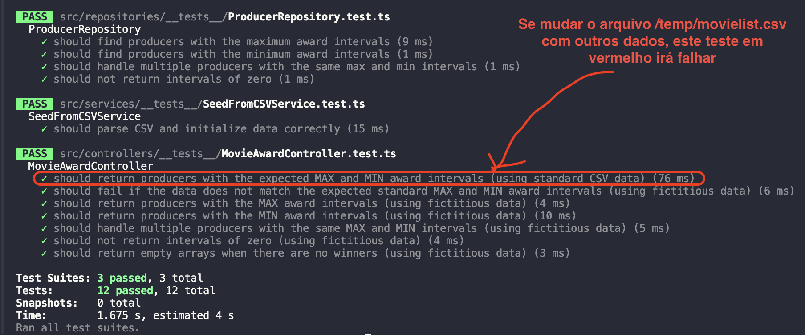

# RESTful API for min and max award intervals 

An application using Node.js, TypeScript, and SQLite3.

## Introduction

This RESTful API reads data from a CSV file and provides information about the producers of winning films with the shortest and longest gap between awards. The API returns the data in the following JSON format:

```JSON
{
    "min": [
        {
            "producer": "Joel Silver",
            "interval": 1,
            "previousWin": 1990,
            "followingWin": 1991
        }
    ],
    "max": [
        {
            "producer": "Matthew Vaughn",
            "interval": 13,
            "previousWin": 2002,
            "followingWin": 2015
        }
    ]
}
```

## Table of Contents

- [Installation](#installation)
- [Usage](#usage)

## Installation

### Prerequisites

- [npm](https://www.npmjs.com/)

### Setup

1. **Clone the repository:**

    ```bash
    git clone git@github.com:francysreymer/rest-api-with-sqlite3-node.git
    cd rest-api-with-sqlite3-node
    ```

2. **Configure the environment variables:**

    Inside the project folder, copy the `.env.example` file and rename it to `.env`. Set the `PORT` variable to the desired port number, or leave it blank to use the default port 3000.

3. **Place a CSV file named `movielist.csv` inside the `/temp` folder.**
    - There is already a file with the same name (`movielist.csv`) containing standard data. This file is used as a reference for integration tests.
    - If you want to test with other data, the file can be modified. However, a specific integration test should fail because the results will be different from those provided by the API with the standard data.



4. **Install dependencies and start the server:**

    ```bash
    npm install
    npm start
    ```

5. **Run the tests:**

    ```bash
    npm test
    ```

## Usage

- **API Endpoint:** Accessible at [http://localhost:3000/api/movies/producers/award-intervals](http://localhost:3000/api/movies/producers/award-intervals).